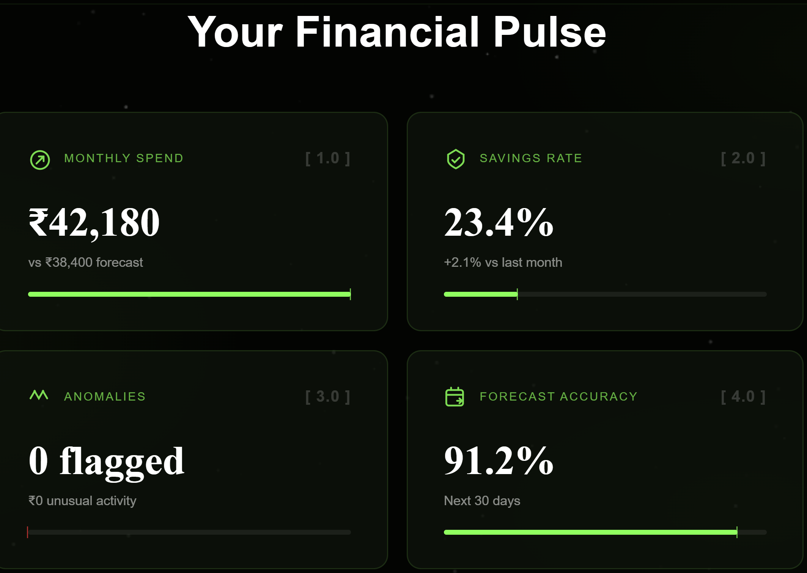
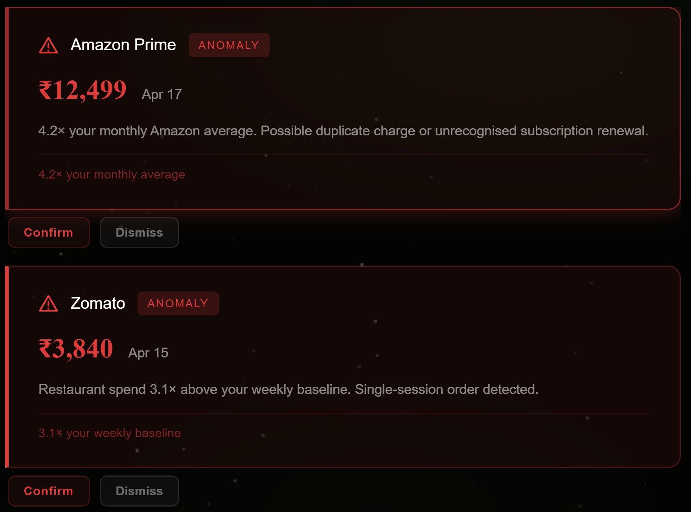

# Luce — AI Finance Copilot


## 🔍 What This Is

Luce is an AI personal finance copilot that categorises bank transactions,
surfaces spending anomalies, forecasts next-month category spend, and
synthesises portfolio news using a graph-based retrieval layer. It is built
on a Next.js 14 frontend, a Claude API categorisation pipeline, LightRAG
served as a Modal serverless function, and Supabase as the unified storage
backend. The product is live, instrumented from day one, and used by real
people managing real money.

## 🚀 Live Demo

[luce.finance](https://luce-sigma.vercel.app/) — upload a bank CSV to see the full
pipeline in action.

## 🤖 Why LightRAG on Modal

- **What gets indexed.** Yahoo Finance RSS headlines for user-held tickers,
  Anthropic and OpenAI blog posts, RBI and Fed policy releases, and general
  market coverage crawled via Crawl4AI. Every document enters the graph as
  an entity with typed relationships, not a flat embedding.

- **What graph captures that vector search loses.** A vector store finds
  articles semantically similar to a query. LightRAG traverses connections
  between entities, so a query like "what news is relevant to someone holding
  INFY and TCS given the RBI held rates today" can join the ticker nodes,
  the macro event node, the sector exposure edges, and the sentiment shift
  across sources in a single retrieval pass. Vector search treats those as
  unrelated documents.

- **What queries become possible.** Users can ask Nexus things like "what
  drove my portfolio tickers this week", "has Infosys been mentioned
  alongside rate decisions before", and "compare analyst sentiment on TCS
  versus last quarter" and receive answers grounded in the full indexed
  corpus rather than a single passage match.

- **Why Modal resolved the two-deployment problem.** Running LightRAG as a
  FastAPI sidecar meant a second deployment on Railway, a second set of
  environment variables, a second failure surface, and a server billing
  continuously between requests. Modal produces two HTTP endpoints from a
  single `modal deploy` command with no idle cost. The entire retrieval
  infrastructure is one file.

## ☁️ Modal Architecture

Modal is a serverless Python function platform. You write a Python function,
decorate it with `@app.function()`, run `modal deploy`, and Modal handles
provisioning, scaling, and teardown automatically. There is no server to
start, no port to manage, and no instance sitting idle overnight.

For Luce, this eliminated a problem that appears simple but compounds
quickly. The LightRAG retrieval layer is Python. The frontend is Next.js on
Vercel. Vercel does not run persistent Python processes. The conventional
solution is a FastAPI sidecar on a second platform such as Railway, which
means two deployments, two sets of secrets, and two things that can break
independently in production.

Modal collapses this to a single `modal deploy modal_lightrag.py` command
that produces exactly two HTTP endpoints:

POST /insert   — indexes documents into the LightRAG corpus
POST /query    — queries the graph and returns a synthesised answer

The Next.js API routes call these endpoints directly. No server to manage.
No second deployment dashboard to check. No Railway instance billing at
3am for zero requests.

The pattern this teaches is broader than LightRAG. Any ML workload that
is request-driven rather than always-on — an embedding pipeline, a
reranker, a custom eval harness — is a better fit for serverless functions
than a persistent sidecar. Modal makes that pattern accessible without
Kubernetes or cloud infrastructure expertise.

## ✨ Features

| Feature | AI Component | What User Sees |
|---|---|---|
| Upload Statement | Gemini API batches 20 transactions per call, returns structured JSON categories | Categorised transaction table with editable labels |
| Anomaly Detection | Statistical baseline per merchant (median + 2σ over 90 days) | Red alert cards with merchant, amount, and multiplier |
| Expense Forecast | Weighted 3-month moving average per category (weights 0.5, 0.3, 0.2) | Progress bars showing actual vs forecast with overspend highlight |
| Portfolio News | LightRAG on Modal traverses ticker-event-sentiment graph | Nexus news card with synthesised weekly brief per holding |
| Ask Your Data | LightRAG query endpoint with full corpus context | Free-text input returning grounded answers about personal spend and market context |

## 🏗️ Architecture

User
│
▼
Next.js 14 (Vercel)
│
├── /api/categorize ──────► Gemini API
│                               │
│                           JSON categories
│                               │
├── /api/anomalies ─────► Supabase (transaction history)
│
├── /api/forecast ──────► Supabase (monthly_summaries)
│
├── /api/news ──────────► Modal / LightRAG
│                               │
│                         POST /insert (RSS headlines)
│                         POST /query  (synthesised brief)
│                               │
│                          Supabase (pgvector + PGKVStorage)
│
└── /api/ask ───────────► Modal / LightRAG (same endpoints)
All data at rest: Supabase PostgreSQL + pgvector
All compute:      Vercel Edge (Next.js) + Modal (Python)

## 📊 Product Analytics

| Metric | Formula | Why It Matters |
|---|---|---|
| Categorisation acceptance rate | 1 − (manual overrides / total categories assigned) | Measures whether the AI is useful or just extra work |
| Anomaly true positive rate | user-confirmed anomalies / total anomalies flagged | Measures detection threshold calibration |
| Forecast MAPE | mean(\|actual − forecast\| / actual) per category | Measures 30-day forecast reliability by spend type |
| Nexus query rate | sessions with ≥1 Nexus query / total active sessions | Measures whether the LightRAG feature is discoverable |
| Week 2 retention | users returning in days 8–14 / users who uploaded in days 1–7 | The only metric that confirms a behaviour change, not a curiosity |

## 🖼️ Screenshots

| Dashboard | Anomaly Alerts | Nexus |
|---|---|---|
|  |  |  |

## ⚙️ Run Locally

```powershell
git clone https://github.com/akstrek/ai-finance-copilot.git
cd ai-finance-copilot
python -m venv venv
.\venv\Scripts\Activate.ps1
pip install modal lightrag-hku asyncpg python-dotenv
npm install
```

Configure environment variables in `.env.local`:

NEXT_PUBLIC_SUPABASE_URL=https://xxxx.supabase.co
NEXT_PUBLIC_SUPABASE_ANON_KEY=xxxx
GEMINI_API_KEY=xxxx
MODAL_INSERT_URL=xxxx
MODAL_QUERY_URL=xxxx

Deploy the Modal LightRAG function:

```powershell
modal token new
modal deploy modal_lightrag.py
```

Copy the two printed endpoint URLs into `MODAL_INSERT_URL` and
`MODAL_QUERY_URL`, then run:

```powershell
npm run dev
```

Open `http://localhost:3000`.

## 🔒 Privacy

Three things Luce never stores:

- Raw bank account numbers or sort codes
- Full transaction descriptions before categorisation — only the assigned
  category and amount are persisted after the Gemini API call returns
- Portfolio ticker data linked to any personally identifiable information
  — tickers are stored against a UUID session ID only

---

*Portfolio link — updated soon.*